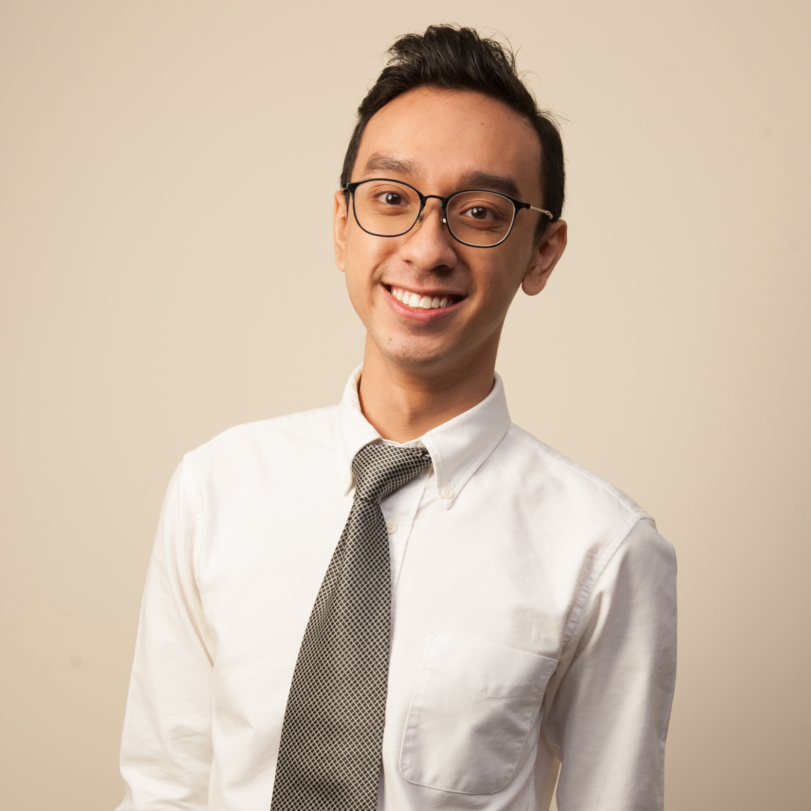
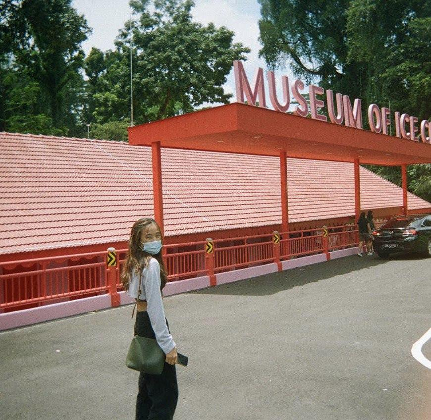
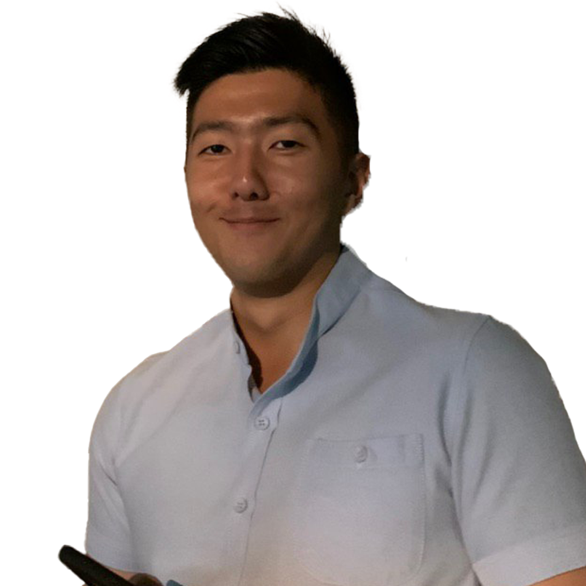
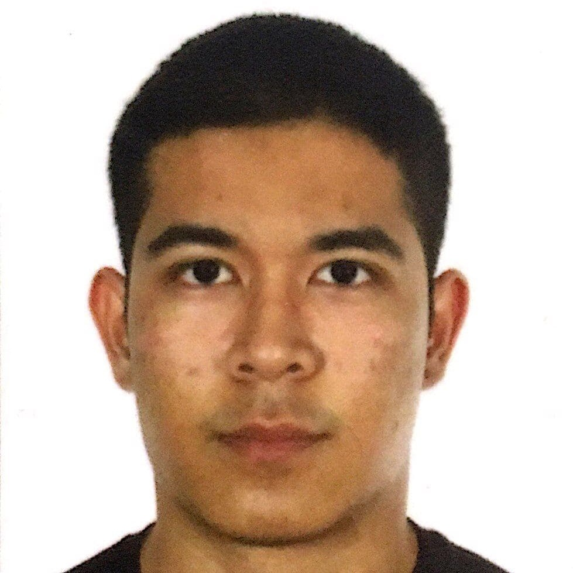
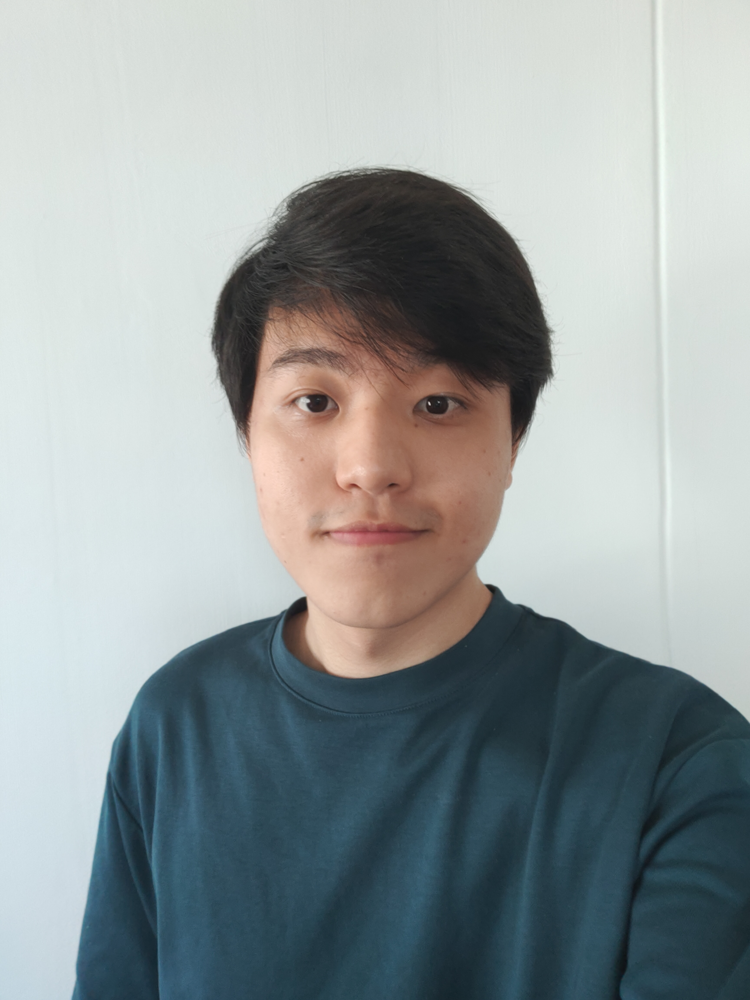

We are a team based in the [School of Computing, National University of Singapore](http://www.comp.nus.edu.sg).

You can reach us at the email `seer[at]comp.nus.edu.sg`

## Project team

### Yusuf Bin Musa

[[github](https://github.com/yusufaine)]
[[portfolio](team/yusufaine.md)]

* Role: Team Lead, GitHub and IntelliJ expert
* Responsibilities: Developer, Integration, Deliverables, and Scheduling and Tracking 

### Gigi Tuang

[[github](http://github.com/gigituang)]
[[portfolio](team/gigituang.md)]

* Role: Developer
* Responsibilities: UI, Developer and testing

### Blake Tan Ting Yu

[[homepage](https://vigilant-hoover-ef8564.netlify.app/)]
[[github](https://github.com/blaketingyu)]
[[portfolio](team/blaketingyu.md)]

* Role: Developer, QA Engineer, GitHub and intelliJ expert
* Responsibilities: Continuous Development and Continuous Integration, testing

### Ryan Aidan

[[github](https://github.com/aidanaden)]
[[portfolio](team/aidanaden.md)]

* Role: Night-owl developer, UI design & dev, Github veteran
* Responsibilities: UI Development, Integration, Deliverables, and Scheduling & Tracking

### Ng Geon Woo, Robin

[[github](http://github.com/oddcorner)]
[[portfolio](team/oddcorner.md)]

* Role: Developer, Code Quality, Git expert
* Responsibilities: UI, Testing, Team Morale
