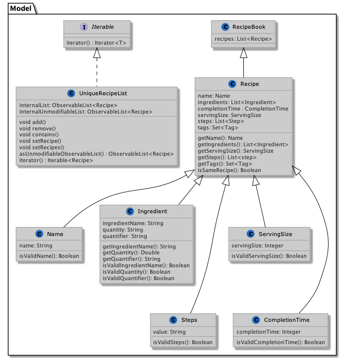

## **[!] Before reading**
To help simplify the understanding of the design of our application – `McKitchen` – we would be referring to our application as `RecipeBook` as it makes more intuitive sense
as our application functions similar to `RecipeBook` which contains a set of `Recipe` and so on.

With that in mind, let's begin.

---

## Table of Content
- [Acknowledgements](#acknowledgements)
- [Setting up, getting started](#setting-up-getting-started)
- [Design](#design)
    * [Architecture](#architecture)
    * [UI component](#ui-component)
    * [Logic component](#logic-component)
    * [Model component](#model-component)
    * [Storage component](#storage-component)
    * [Common classes](#common-classes)
- [Implementation](#implementation)
    * [Clear feature](#clear-feature)
    * [\[Proposed\] Undo/redo feature](#proposed-undoredo-feature)
        + [Design considerations](#design-considerations)
    * [\[Proposed\] Advance find feature](#proposed-advance-find-feature)
- [Documentation, logging, testing, configuration, dev-ops](#documentation-logging-testing-configuration-dev-ops)
- [Appendix: Requirements](#appendix-requirements)
    * [Product scope](#product-scope)
    * [User stories](#user-stories)
    * [Use cases](#use-cases)
    * [Non-Functional Requirements](#non-functional-requirements)
    * [Glossary](#glossary)
- [Appendix: Instructions for manual testing](#appendix-instructions-for-manual-testing)
    * [Launch and shutdown](#launch-and-shutdown)
    * [Adding a recipe](#adding-a-recipe)
    * [Editing a recipe](#editing-a-recipe)
    * [Deleting a recipe](#deleting-a-recipe)
    * [Viewing a recipe](#viewing-a-recipe)
    * [Finding a recipe](#finding-a-recipe)
    * [Clearing the recipe book](#clearing-the-recipe-book)
    * [Resetting the recipe book](#resetting-the-recipe-book)

--------------------------------------------------------------------------------------------------------------------

## **Acknowledgements**

* McDonald's for inspiring our project and logo.
* AddressBook Level-3 from [https://se-education.org/](https://se-education.org/) which served as a base for our application.
* [JavaFX](https://openjfx.io/) for the GUI functionality.

--------------------------------------------------------------------------------------------------------------------

## **Setting up, getting started**

Refer to the guide [_Setting up and getting started_](SettingUp.md).

--------------------------------------------------------------------------------------------------------------------

## **Design**

:bulb: **Tip:** The `.puml` files used to create diagrams in this document can be found in the [diagrams](https://github.com/AY2122S2-CS2103T-T17-2/tp/tree/master/docs/umlDiagrams) folder. Refer to the [_PlantUML Tutorial_ at se-edu/guides](https://se-education.org/guides/tutorials/plantUml.html) to learn how to create and edit diagrams.

### Architecture

The ***Architecture Diagram*** given above explains the high-level design of the App.

Given below is a quick overview of main components and how they interact with each other.

**Main components of the architecture**

**`Main`** has two classes called [`Main`](https://github.com/AY2122S2-CS2103T-T17-2/tp/blob/master/src/main/java/seedu/address/Main.java) and [`MainApp`](https://github.com/AY2122S2-CS2103T-T17-2/tp/blob/master/src/main/java/seedu/address/MainApp.java). It is responsible for,
* At app launch: Initializes the components in the correct sequence, and connects them up with each other.
* At shut down: Shuts down the components and invokes cleanup methods where necessary.

[**`Commons`**](#common-classes) represents a collection of classes used by multiple other components.

The rest of the App consists of four components.

* [**`UI`**](#ui-component): The UI of the App.
* [**`Logic`**](#logic-component): The command executor.
* [**`Model`**](#model-component): Holds the data of the App in memory.
* [**`Storage`**](#storage-component): Reads data from, and writes data to the hard disk.

**How the architecture components interact with each other**

The *Sequence Diagram* below shows how the components interact with each other for the scenario where the user issues the command `delete Aglio Olio`.

Each of the four main components (also shown in the diagram above),

* defines its *API* in an `interface` with the same name as the Component.
* implements its functionality using a concrete `{Component Name}Manager` class (which follows the corresponding API `interface` mentioned in the previous point.

For example, the `Logic` component defines its API in the `Logic.java` interface and implements its functionality using the `LogicManager.java` class which follows the `Logic` interface. Other components interact with a given component through its interface rather than the concrete class (reason: to prevent outside component's being coupled to the implementation of a component), as illustrated in the (partial) class diagram below.

The sections below give more details of each component.

### UI component

The **API** of this component is specified in [`Ui.java`](https://github.com/AY2122S2-CS2103T-T17-2/tp/blob/master/src/main/java/seedu/address/ui/Ui.java)

The UI consists of a `MainWindow` that is made up of parts e.g.`CommandBox`, `ResultDisplay`, `HelpWindow`,`RecipeListPanel` etc. All these, including the `MainWindow`, inherit from the abstract `UiPart` class which captures the commonalities between classes that represent parts of the visible GUI.

The `UI` component uses the JavaFx UI framework. The layout of these UI parts are defined in matching `.fxml` files that are in the `src/main/resources/view` folder. For example, the layout of the [`MainWindow`](https://github.com/AY2122S2-CS2103T-T17-2/tp/blob/master/src/main/java/seedu/address/ui/MainWindow.java) is specified in [`MainWindow.fxml`](https://github.com/AY2122S2-CS2103T-T17-2/tp/blob/master/src/main/resources/view/MainWindow.fxml)

The `UI` component,

* executes user commands using the `Logic` component.
* listens for changes to `Model` data so that the UI can be updated with the modified data.
* keeps a reference to the `Logic` component, because the `UI` relies on the `Logic` to execute commands.
* depends on some classes in the `Model` component, as it displays `Recipe` object residing in the `Model`.

### Logic component

**API** : [`Logic.java`](https://github.com/AY2122S2-CS2103T-T17-2/tp/blob/master/src/main/java/seedu/address/logic/Logic.java)

Here's a (partial) class diagram of the `Logic` component:

How the `Logic` component works:
1. When `Logic` is called upon to execute a command, it uses the `RecipeBookParser` class to parse the user command.
2. This results in a `Command` object (more precisely, an object of one of its subclasses e.g., `AddCommand`) which is executed by the `LogicManager`.
3. The command can communicate with the `Model` when it is executed (e.g. to add a recipe).
4. The result of the command execution is encapsulated as a `CommandResult` object which is returned from `Logic`.

The Sequence Diagram below illustrates the interactions within the `Logic` component for the `execute("delete -x 1")` API call.

:information_source: **Note:** The lifeline for `DeleteCommandParser` should end at the destroy marker (X) but due to a limitation of PlantUML, the lifeline reaches the end of diagram.

Here are the other classes in `Logic` (omitted from the class diagram above) that are used for parsing a user command:

How the parsing works:
* When called upon to parse a user command, the `RecipeBookParser` class creates an `*CommandParser` (`*` is a placeholder for the specific command name e.g., `AddCommandParser`) which uses the other classes shown above to parse the user command and create a `*Command` object (e.g., `AddCommand`) which the `RecipeBookParser` returns back as a `Command` object.
* All `*CommandParser` classes (e.g., `AddCommandParser`, `DeleteCommandParser`, ...) inherit from the `Parser` interface so that they can be treated similarly where possible e.g, during testing.

### Model component
**API** : [`Model.java`](https://github.com/AY2122S2-CS2103T-T17-2/tp/blob/master/src/main/java/seedu/address/model/Model.java)

The `Model` component,

* stores the recipe book data i.e., all `Recipe` objects (which are contained in a `UniqueRecipeList` object).
* stores the currently 'selected' `Recipe` objects (e.g., results of a search query) as a separate _filtered_ list which is exposed to outsiders as an unmodifiable `ObservableList<Recipe>` that can be 'observed' e.g. the UI can be bound to this list so that the UI automatically updates when the data in the list change.
* stores a `UserPref` object that represents the user’s preferences. This is exposed to the outside as a `ReadOnlyUserPref` objects.
* does not depend on any of the other three components (as the `Model` represents data entities of the domain, they should make sense on their own without depending on other components)

:information_source: **Note:** An alternative (arguably, a more OOP) model is given below. It has a `Tag` list in the `RecipeBook`, which `Recipe` references. This allows `RecipeBook` to only require one `Tag` object per unique tag, instead of each `Recipe` needing their own `Tag` objects. 

### Storage component
**API** : [`Storage.java`](https://github.com/AY2122S2-CS2103T-T17-2/tp/blob/master/src/main/java/seedu/address/storage/Storage.java)

The `Storage` component,
* can save recipe book data in json format, and read them back into corresponding objects
* can save user preference data in json format, and read them back into corresponding objects.
* inherits from both `RecipeBookStorage` and `UserPrefStorage`, which means it can be treated as either one (if only the functionality of only one is needed).
* depends on some classes in the `Model` component (because the `Storage` component's job is to save/retrieve objects that belong to the `Model`)
* The `JsonAdaptedRecipe` contains the standard attributes of a `Recipe` in `JsonProperty` format.
* `JsonAdaptedRecipe` also contains attributes in a list such as
* `List<JsonAdaptedSteps>`, `List<JsonAdaptedIngredient>` and `List<JsonAdaptedTag>` format.

### Common classes

Classes used by multiple components are in the `seedu.address.commons` package.

--------------------------------------------------------------------------------------------------------------------

## **Implementation**

This section describes some noteworthy details on how certain features are implemented.

### Clear feature
This feature allows the application to clear all the existing recipes in the application. Users will be able to delete all the existing recipes in one command.

**Step 1**. The user launches the application.  
**Step 2**. The user executes `clear` command to clear all recipes.  
**Step 3**. The user will be prompted a `yes` and `no` to confirm his clearance
- if the user inputs `yes`, the RecipeBook will be cleared
- if the user inputs `no`, the `clear` command is cancelled. 
- if the user inputs neither `yes` or `no`, 
  Expected: Unknown Command!Type in the clear command again if you wish to clear

### \[Proposed\] Undo/redo feature

The proposed undo/redo mechanism is facilitated by `VersionedRecipeBook`. It extends `RecipeBook` with an undo/redo history, stored internally as an `recipeBookStateList` and `currentStatePointer`. Additionally, it implements the following operations:

* `VersionedRecipeBook#commit()` — Saves the current recipe book state in its history.
* `VersionedRecipeBook#undo()` — Restores the previous recipe book state from its history.
* `VersionedRecipeBook#redo()`— Restores a previously undone recipe book state from its history.

These operations are exposed in the `Model` interface as `Model#commitRecipeBook()`, `Model#undoRecipeBook()` and `Model#redoRecipeBook()` respectively.

Given below is an example usage scenario and how the undo/redo mechanism behaves at each step.

**Step 1**. The user launches the application for the first time. The `VersionedRecipeBook` will be initialized with the initial recipe book state, and the `currentStatePointer` pointing to that single recipe book state.

**Step 2**. The user executes `delete -x 5` command to delete the 5th recipe in the recipe book. The `delete` command calls `Model#commitRecipeBook()`, causing the modified state of the recipe book after the `delete -x 5` command executes to be saved in the `recipeBookStateList`, and the `currentStatePointer` is shifted to the newly inserted recipe book state.

**Step 3**. The user executes `add -n Miso Soup …` to add a new recipe. The `add` command also calls `Model#commitRecipeBook()`, causing another modified recipe book state to be saved into the `recipeBookStateList`.

:information_source: **Note:** If a command fails its execution, it will not call `Model#commitRecipeBook()`, so the recipe book state will not be saved into the `recipeBookStateList`.

**Step 4**. The user now decides that adding the recipe was a mistake, and decides to undo that action by executing the `undo` command. The `undo` command will call `Model#undoRecipeBook()`, which will shift the `currentStatePointer` once to the left, pointing it to the previous recipe book state, and restores the recipe book to that state.

:information_source: **Note:** If the `currentStatePointer` is at index 0, pointing to the initial RecipeBook state, then there are no previous RecipeBook states to restore. The `undo` command uses `Model#canUndoRecipeBook()` to check if this is the case. If so, it will return an error to the user rather than attempting to perform  `undo`.  

The following sequence diagram shows how the undo operation works:

The `redo` command does the opposite — it calls `Model#redoRecipeBook()`, which shifts the `currentStatePointer` once to the right, pointing to the previously undone state, and restores the recipe book to that state.

:information_source: **Note:** If the `currentStatePointer` is at index `recipeBookStateList.size() - 1`, pointing to the latest recipe book state, then there are no undone RecipeBook states to restore. The `redo` command uses `Model#canRedoRecipeBook()` to check if this is the case. If so, it will return an error to the user rather than attempting to perform the redo.

**Step 5**. The user then decides to execute the command `list`. Commands that do not modify the recipe book, such as `list`, will usually not call `Model#commitRecipeBook()`, `Model#undoRecipeBook()` or `Model#redoRecipeBook()`. Thus, the `recipeBookStateList` remains unchanged.

**Step 6**. The user executes `clear -f`, which calls `Model#commitRecipeBook()`. Since the `currentStatePointer` is not pointing at the end of the `recipeBookStateList`, all recipe book states after the `currentStatePointer` will be purged. Reason: It no longer makes sense to redo the `add -n Miso Soup …` command. This is the behavior that most modern desktop applications follow.

The following activity diagram summarizes what happens when a user executes a new command

#### Design considerations

**Aspect: How undo & redo executes:**

* **Alternative 1 (current choice):** Saves the entire recipe book.
    * Pros: Easy to implement.
    * Cons: May have performance issues in terms of memory usage.

* **Alternative 2:** Individual command knows how to undo/redo by
  itself.
    * Pros: Will use less memory (e.g. for `delete`, just save the recipe being deleted).
    * Cons: We must ensure that the implementation of each individual command are correct.

---

### \[Proposed\] Advance find feature
The proposed advanced find feature refines how the current find command works by introducing `RecipeDoesNotContainKeywordPredicate`. 

Currently, the purpose of the `find` feature of our application is to give users the possibility of what `Recipe` they can cook based on the specified keywords such as recipe name, ingredients available, or cuisine in the form of tags. As such, we would like to improve how the find feature works but allowing the users to specify "must not contain" as part of their keywords to allow greater user experience.

Given below is an example usage scenario and how the advanced find would behave.

**Step 1**. The user launches the application after filling in some recipes and wants to narrow down their search due to their dietary restriction. The user executes `find noodle -peanut`. The `find` command separates the user input to 2 sets based on whether it has been prefixed with `-`.

**Step 2**. The `find` command filters out the recipes that match `RecipeDoesNotContainKeywordPredicate`. In this case, that would mean that it filters out recipes that contain "peanut".

**Step 3**. The `find` command then collects all the recipes that match `RecipeContainsKeywordPredicate` and displays it to the `RecipeListPanel`

--------------------------------------------------------------------------------------------------------------------

## **Miscellaneous guides**

* [Documentation guide](Documentation.md)
* [Testing guide](Testing.md)
* [Logging guide](Logging.md)
* [Configuration guide](Configuration.md)
* [DevOps guide](DevOps.md)

--------------------------------------------------------------------------------------------------------------------

## **Appendix: Requirements**

### Product scope

**Target user profile**:
* prefers storing recipes locally to their computer
* wants to be able to quickly access their recipes that they have stored
* wants to experiment with their recipes and adjust them accordingly
* prefer desktop apps over other types
* can type fast
* prefers typing to mouse interactions
* is reasonably comfortable using CLI apps

**Value proposition**: manage recipes faster than a typical GUI-driven app

### User stories

Priorities: High (must have) - `* * *`, Medium (nice to have) - `* *`, Low (unlikely to have) - `*`

| Priority | As a …​                                | I want to …​                                      | So that I can…​                                                      |
|----------|----------------------------------------|---------------------------------------------------|----------------------------------------------------------------------|
| `* * *`  | user                                   | be able to see a list of recipes                  | view all the recipes that I have stored                              |
| `* * *`  | user                                   | be able to save and load                          | Automatically see my recently stored recipes                         |
| `* * *`  | user                                   | be able to view my recipes                        | see the full details of the recipe such as the ingredients and steps |
| `* * *`  | user                                   | be able to create recipes                         | add them to the app and save them for later viewing                  |
| `* * *`  | user                                   | be able to delete recipes from my list of recipes | remove them from a text file in my local computer                    |
| `* * *`  | user                                   | be able to edit my recipes                        | make further changes at any point of time                            |
| `* *`    | user with dietary restrictions         | be able to prepare suitable recipes               | cook more of them easily                                             |
| `* *`    | student who has online classes at home | cook with what I have at home                     | save money                                                           |
| `* *`    | person who cooks well                  | be able to export my recipes                      | share them with people who are curious about a certain dish          |

### Use cases

(For all use cases below, the **System** is the `RecipeBook` and the **Actor** is the `user`, unless specified otherwise)

**Use case: Add a recipe**

*Actor: User*

**Guarantees**
1. Recipe will be added to a new or existing list of recipes only if the name, completionTime, servingSize, ingredients, steps and tags are valid

**MSS**
1. User requests to add recipes
2. RecipeBook Adds the recipe to a new or existing list of recipes

   Use case ends.

**Extensions**

* 2a. The list is empty.
    * RecipeBook creates a new list.
* 2b. The list is not empty.
    * RecipeBook checks if the input fields are valid
        * If input fields are valid
            * RecipeBook adds recipe

              Use case ends.

        * If input fields are invalid,
            * RecipeBook shows an error message

              Use case resumes at step 1

**Use case: Delete a recipe**

*Actor: User*

*Preconditions: User should have an existing list of recipes stored in the local file*

**Guarantees**
1. Recipe will be deleted from a list of recipes only if the recipe exists in the recipe list

**MSS**
1. User requests to list recipes
2. RecipeBook shows a list of recipes
3. User requests to delete a specific recipe in the list
4. RecipeBook deletes the recipe

   Use case ends.

**Extensions**

* 2a. The list is empty.

  Use case ends.

* 4a. RecipeBook checks if the given recipe index or name is valid.
    * If recipe index or name is valid  

      Use case ends.

    * If recipe index or name is invalid,
        * RecipeBook shows an error message

          Use case resumes at step 2

**Use case: View a recipe**

*Actor: User*

*Preconditions: User should have an existing list of recipes stored in the local file*

**Guarantees**
1. Recipe can be viewed only if the recipe exists in the recipe list

**MSS**
1. User requests to list recipes
2. RecipeBook shows a list of recipes
3. User requests to view a specific recipe in the list
4. RecipeBook displays the specific recipe requested by the user for viewing

   Use case ends.

**Extensions**
* 2a. The list is empty.

  Use case ends.

* 4a. RecipeBook checks if the given index is valid.
    * If index is valid

      Use case ends.

    * If index is invalid,
        * RecipeBook shows an error message

          Use case resumes at step 2

**Use case: Edit a recipe**

*Actor: User*

*Preconditions: User should have an existing list of recipes stored in the local file*

**Guarantees**
1. Recipe will be edited only if the recipe exists in the recipe list and fields to be edited are valid

**MSS**

1. User requests to list recipes
2. RecipeBook shows a list of recipes
3. User requests to edit a specific recipe in the list
4. RecipeBook updates the changes in the recipe

   Use case ends.

**Extensions**

* 2a. The list is empty.

  Use case ends.

* 3a. RecipeBook checks if the given recipe name or index is valid.
    * If recipe name or index is valid
        * Use case resumes at step 3b

    * If recipe name or index is invalid,
        * RecipeBook shows an error message

          Use case resumes at step 2

* 3b. RecipeBook checks if the fields to be edited are valid
    * if input fields are valid
        * RecipeBook updates specified recipe with input values

          Use case ends
    * if input fields are invalid
        * RecipeBook shows an error message

          Use case resumes at step 2

**Use case: Clear the recipe book**

*Actor: User*

*Preconditions: None*

**Guarantees**
1. All recipe entries will be cleared from the recipe book.

**MSS**

1. RecipeBook shows a list of recipes
2. User requests to clear the list of recipes
3. RecipeBook asks for confirmation
4. User confirms to clear
5. RecipeBook clears all the entries in the recipe book
   Use case ends.

**Extensions**
* 2a. User requests to do a force clear on the list of recipes.
    * 2a1. If the entered input contains the forced clear prefix.
      Use case resumes from step 5.

* 4a. User cancels the clear request.
    * 4a1. RecipeBook abort the clear process.
      Use case ends.
    

**Use case: Find a recipe**

_Actor: User_  

_Preconditions: None_

**Guarantees**
1. Returns a list of recipes that match any of the keywords that the user provided, or 
2. Informs the user that no recipe matches the keyword that they had provided.

**MSS**
1. User requests to list recipes
2. RecipeBook shows a list of recipes
3. User requests to search for a recipe based on the keywords provided
4. RecipeBook displays a list of recipes that match any of the keywords provided.

**Extensions**
* 2a. The list is empty  
  Use case ends
* 4a. RecipeBook checks if any of the keywords match any of the recipes inside it
  * There are one or more matches  
    Use case ends.
  * There are no matches
    RecipeBook informs user that there are no recipes that match the keyword(s) provided and shows an empty list of recipes  
    Use case ends.

    
**Use case: Resets the recipe book**

*Actor: User*

*Preconditions: None*

**Guarantees**
1. All recipe entries will be cleared from the recipe book and be loaded with the default preloaded recipes.

**MSS**

1. RecipeBook shows a list of recipes
2. User requests to reset the list of recipes
3. RecipeBook asks for confirmation
4. User confirms to reset
5. RecipeBook clears all the entries in the recipe book and the recipe book will be loaded with the preloaded recipes.
   Use case ends.

**Extensions**
* 2a. User requests to do a force reset on the list of recipes.
    * 2a1. If the entered input contains the forced reset prefix.
      Use case resumes from step 5.

* 4a. User cancels the reset request.
    * 4a1. RecipeBook abort the reset process.
      Use case ends.
---

### Non-Functional Requirements

1. Should work on any _mainstream OS_ as long as it has Java `11` or above installed.
2. Should be able to hold up to 1000 recipes without a noticeable sluggishness in performance for typical usage.
3. A user with above average typing speed for regular English text (i.e. not code, not system admin commands) should be able to accomplish most of the tasks faster using commands than using the mouse.
4. Should not use a DBMS to store data.
5. Should work without requiring an installer.
6. GUI should be usable with resolutions 1280x720 and higher, for screen scales 150%
7. Should package everything into a single JAR file

### Glossary

* **Mainstream OS**: Windows, Linux, Unix, OS-X
* **DBMS**: Database Management System
* **GUI**: Graphic User interface
* **JAR**: Java Archive (Java executable file)
* **MSS**: Main Success Scenario
* **Extensions**: are "add-on"s to the MSS that describe exceptional/alternative flow of events. They describe variations of the scenario that can happen if certain things are not as expected by the MSS.
* **Guarantees**: Specify what the use case promises to give us at the end of its operation
* **Preconditions**: Specify the specific state you expect the system to be in before the use case starts

--------------------------------------------------------------------------------------------------------------------

## **Appendix: Instructions for manual testing**

Given below are instructions to test the app manually.

:information_source: **Note:** These instructions only provide a starting point for testers to work on;
testers are expected to do more *exploratory* testing.

### Launch and shutdown

1. Initial launch

    1. Download the latest McKitchen.jar file and copy into the folder you want to use as the home folder for your McKitchen.

    2. To run the application: Open Terminal/Command Prompt in home folder (step 1) and run the following command: `java -jar McKitchen.jar`.

3. Saving window preferences

    1. Resize the window to an optimum size. Move the window to a different location. Close the window.

    2. Re-launch the app from the Terminal/Command Prompt in home folder and run the command `java -jar McKithen.jar`. 
       Expected: The most recent window size and location is retained.

### Adding a recipe

1. Adding a new recipe

    1. Prerequisites: Prepare a list of required attributes including recipe name, completion time (in mins), serving size (no. of portions), ingredients, steps and tags (optional).

    2. Test case: `add -n Recipename1 -d 5 -ss 2 -i IngredientOne 10 spoons | IngredientTwo 5 | IngredientThree 100 grams -s Step 1 | Step 2 | Step 3 -t Tag1 | Tag2 | Tag3` 
        Expected: A new recipe with the name "Recipename1" with a 5 min completion time, serving size of 2, 10 spoons of IngredientOne, 5 of IngredientTwo and 100 grams of IngredientThree as well as the steps of "Step1", "Step2" and "Step3" with tags of "Tag1", "Tag2", "Tag3".

    3. Test case: `add -n Recipename1 -d 5 -ss 2 -i IngredientOne 10 spoons | IngredientTwo 5 | IngredientThree 100 grams` 
       Expected: No recipe is added due to missing recipe steps. Valid command details are shown in the error message.

    4. Other incorrect add commands to try: `add -n`, `add`, `add -ss`, `add -d`, `add -s Step2`  
       Expected: Similar to previous.

### Editing a recipe

1. Editing a new recipe

    1. Prerequisites: List all recipes using the `list` command. Only 9 recipes in the list. Prepare the attributes to be updated.

    2. Test case: `edit -x 1 -n Recipename1 -d 5 -ss 2 -i IngredientOne 10 spoons | IngredientTwo 5 | IngredientThree 100 grams -s Step 1 | Step 2 | Step 3` 
        Expected: Edits recipe with index 1 with a new name of "Recipename1", completion time of 5, serving size of 2, 10 spoons of IngredientOne, 5 of IngredientTwo and 100 grams of IngredientThree as well as steps of "Step1", "Step2" and "Step3".

    3. Test case: `edit -n Recipename1 -d 5 -ss 2 -i IngredientOne 10 spoons | IngredientTwo 5 | IngredientThree 100 grams -s Step 1 | Step 2 | Step 3` 
       Expected: No recipe is edited due to missing recipe index. Error details shown in the status message.

    4. Other incorrect delete commands to try: `edit 1`, `edit -x 1`, `edit -x 1 -ss`, `edit -x 1 -d`  
       Expected: No recipe is edited due to missing recipe attributes. Error details shown in the status message.

### Deleting a recipe

1. Deleting a recipe while all recipes are being shown

    1. Prerequisites: List all recipes using the `list` command. Only 9 recipes in the list.

    2. Test case: `delete -x 1` 
       Expected: First recipe is deleted from the list. Details of the deleted recipe shown in the status message.
   
    3. Test case: `delete Aglio Olio`  
       Expected: First recipe is deleted from the list. Details of the deleted recipe shown in the status message. 

    4. Test case: `delete -x 0` 
       Expected: No recipe is deleted. Error details shown in the status message.

    5. Test case: `delete nuggets` 
       Expected: Recipe does not exist in the recipe book.

    7. Other incorrect delete commands to try: `delete`, `delete -x -1`, `delete -x 10`, `delete 1`, `delete -x aglio olio`  
       Expected: Similar to previous.
    

### Viewing a recipe

1. Viewing a recipe while all recipes are being shown

    1. Prerequisites: List all recipes using the `list` command. Multiple recipes in the list.

    2. Test case: `view -x 1` 
       Expected: Contents of the first recipe is displayed in the result box. 

    3. Test case: `view -x -1` 
       Expected: No recipe is displayed in the result box. Invalid command format error is displayed in the result box with an example showing the correct usage of the view command. 
    
    4. Test case: `view -x i` (where i is larger than the list size) 
       Expected: Recipe not found message is displayed in the result box. 

    5. Other incorrect view commands to try: `view`, `view -t`, `view -s`, `view -x 0` 
          Expected: Similar to test case 3.

### Finding a recipe

1. Finding a recipe while all recipes are being shown
   1. Prerequisites: List all recipes using the `list` command. Multiple recipes in the list.
   2. Test case: `find garlic` 
      Expected: List of recipes will be filtered out to recipes that have garlic as one of their ingredients.
   3. Test case: `find garlic | western`  
      Expected: List of recipes will be filtered out to recipes that have garlic as one of their ingredients **or** is a western dish.
   4. Test case: `find aglio olio`  
      Expected: List of recipes will be filtered out to recipes that contain "aglio olio". In this case it is the name of a dish that exists in the recipe book and it would be the only recipe that is shown in the recipe list.
   5. Test case: `find gja390j4fa3`  
      Expected: Result display would show that there are no recipes that match or contain "gja390j4fa3". This input extends to any arbitrary string that does not match any of the recipe or its contents (name, ingredient, tag).

### Clearing the recipe book
1. Clearing the recipe book populated with existing recipes
   1. Prerequisites: List all recipes using the `list` command. Multiple recipes in the list.
   2. Test case: `clear -f`  
      Expected: All the recipes will be cleared from the recipe book.
   3. Test case: `clear`  
      Expected: Confirmation prompt shows up, requesting for confirmation.  
      - Test case: `yes`  
        Expected: All the recipes will be cleared from the recipe book.
      - Test case: `no`  
        Expected: There will be no changes made to the existing list of recipes.

### Resetting the recipe book
1. Resetting the recipe book populated with recipes that are not in the list of preloaded recipes. 
    1. Prerequisites: List all recipes using the `list` command. Multiple recipes in the list with recipes that are not in the list of preloaded recipes.
    2. Test case: `reset -f`  
       Expected: The recipe book will reset back to the default preloaded recipes and all the recipes that are not in the default preloaded recipe provided by the application are cleared from the recipe book. 
    3. Test case: `reset`  
       Expected: Confirmation prompt shows up, requesting for confirmation.  
       - Test case: `yes`
                 - Expected: The recipe book will reset back to the default preloaded recipes and all the recipes that are not in the default preloaded recipe provided by the application are cleared from the recipe book.
              - Test case: `no`
                 - Expected: There will be no changes made to the existing list of recipes.
                
2. Resetting the recipe book populated with an empty recipe book. 
    1. Prerequisites: Clear all the recipes from the recipe book using the `clear` command.
    2. Test case: `reset -f`  
       Expected: The recipe book will reset back to the default preloaded recipes.
    3. Test case: `reset`  
       Expected: Confirmation prompt shows up, requesting for confirmation.  
       - Test case: `yes`  
         Expected: The recipe book will reset back to the default preloaded recipes.
       - Test case: `no`  
         Expected: There will be no changes made to the existing list of recipes and the recipe book will remain empty.

3. Resetting the recipe book with corrupted data in the data json file.
    1. Prerequisites: Deleting an attribute from a recipe in the json file. For example, deleting the name field for a recipe.
       Expected: McKitchen contains 0 recipes when the application launches.
    2. Test case: `reset -f`  
       Expected: The recipe book will reset back to the default preloaded recipes.
    3. Test case: `reset`  
       Expected: Confirmation prompt shows up, requesting for confirmation.  
       - Test case: `yes`  
         Expected: The recipe book will reset back to the default preloaded recipes.
       - Test case: `no`  
         Expected: There will be no changes made to the existing list of recipes and the recipe book will remain empty.
