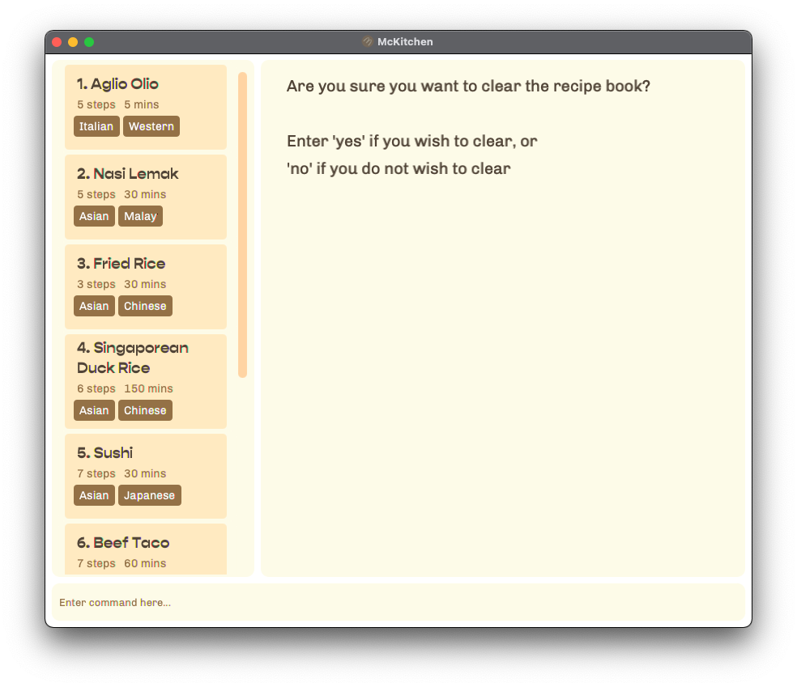
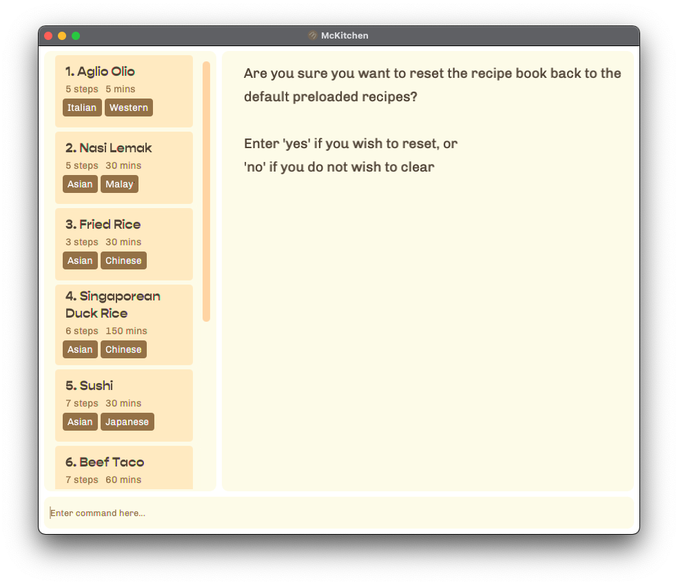

McKitchen (My-CLI-Kitchen) is a desktop application that can quickly store, edit, and search for recipes by running a single command. This is ideal for the fast typists, amateur cooks, busy students or executives who want a simple way to store or search for simple recipes to cook.

## About this guide
This guide is intended to be used by those who are interested in how to use McKitchen -- whether you're a user of McKitchen or simply doing research, welcome! A [table of content](#table-of-content) is located just below this section to improve navigation of this guide and bring you to the portion of the guide that you are interested in. Additionally, in each of those sections, we've linked a small text titled "return to Table of Content" for you to be able to quickly jump back to the top should you choose to. 

Throughout the document you may encounter some of these symbols, and they denote the following:
* :information_source: : General tips regarding the section or feature that you are currently on
* :computer: : Tips for advanced users
* :heavy_exclamation_mark: : **Warning!** Pay close attention to them to understand the potential drawbacks related to the section or feature that you are currently on.

---

## Table of Content
- [Quick start](#quick-start)
- [Command Summary](#command-summary)
    * [Understanding the command format](#understanding-the-command-format)
- [Features](#features)
    * [Add a new recipe: `add`](#add-a-new-recipe-add)
    * [Clear (delete all) existing recipes: `clear`](#clear-delete-all-existing-recipes-clear)
    * [Delete an existing recipe: `delete`](#delete-an-existing-recipe-delete)
    * [Edit an existing recipe: `edit`](#edit-an-existing-recipe-edit)
    * [Exiting the program: `exit`](#exiting-the-program-exit)
    * [Find an existing recipe: `find`](#find-an-existing-recipe-find)
    * [Get help on how to use McKitchen: `help`](#get-help-on-how-to-use-mckitchen-help)
    * [List all stored recipes: `list`](#list-all-stored-recipes-list)
    * [Load recipes](#load-recipes)
    * [Save recipes](#save-recipes)
    * [Reset to the default recipes: `reset`](#reset-to-the-default-recipes-reset)
    * [View an existing recipe: `view`](#view-an-existing-recipe-view)
- [FAQ](#faq)

---

## Quick start

In this section, we will get you started on the things you need to do prior to using McKitchen -- namely, installing Java 11.

1. Ensure you have Java `11` or above installed in your computer by clicking [here](https://www.java.com/en/download/help/version_manual.html).
    - If you do not have Java version `11` or later installed, refer to [this installation guide](https://docs.oracle.com/en/java/javase/11/install/overview-jdk-installation.html).

2. Download the latest `McKitchen.jar` from [our GitHub page](https://github.com/AY2122S2-CS2103T-T17-2/tp/releases).

3. Copy the file to the folder you want to use as the _home folder_ for your McKitchen.

4. To run the application:
   - Open the terminal in the _home folder_ (Step 3) and issue the following command: `java -jar McKitchen.jar`
   

:information_source: :computer: **Alternatively**, you can allow the application Full Disk Access and be able to run the McKitchen by double-clicking on it by following [this post](https://discussions.apple.com/thread/252709578).

The GUI similar to the below should appear in a few seconds. Note how the app contains some sample data. 

5. Type the command where prompted "Enter command here" and press Enter to execute it.
    * Example: typing **`help`** and pressing Enter will open the help window which would bring provide you with a link and direct you to the [Command Summary](#command-summary).

6. Refer to the [Features](#features) below for details of each command.

---

## Command Summary
### Understanding the command format
1. Almost all the details of the commands are needed to be given before the command can be executed properly.
    * **Optional** details of the command are enclosed in square brackets such as [optional details].
        + Example: `command <recipe name> or -x <recipe number from the list> [optional details]`
        + A clearer example of this can be seen in the [delete command](#delete-an-existing-recipe-delete), or [edit command](#edit-an-existing-recipe-edit).
      
2. What does it mean when the input command says "... separated by pipe"?
    * The pipe symbol is typically located above the "Enter" button on the keyboard and can be typed by using `Shift` + ``\ ``, resulting in `|`.
    * This means that the data you enter would be separated by the pipe symbol and would be as though you had entered them separately.
        + Example: `-t Western | Italian | Vegetarian` would be the same as `-t Western -t Italian -t Vegetarian`

4. For more details on each action, feel free to click on it. It would direct you to the explanation of the feature.

| Action                                                                                   | Command format                                                                                                                                                                                                                                                                                                                                                                                                                                                                                                                                                             |
|------------------------------------------------------------------------------------------|----------------------------------------------------------------------------------------------------------------------------------------------------------------------------------------------------------------------------------------------------------------------------------------------------------------------------------------------------------------------------------------------------------------------------------------------------------------------------------------------------------------------------------------------------------------------------|
| [add a new recipe](#add-a-new-recipe-add)                                                | `add -n <name of recipe> -d <prep time of recipe (max: 525600 mins)> -ss <serving size/portions of recipe (max: 1000 servings)> -i <ingredients separated by pipe> -s <steps separated by pipe> [-t tags separated by pipe]`                                                                                                                                                                                                                                                                                                                                               |
| [clear existing list of recipes](#clear-delete-all-existing-recipes-clear)               | `clear` (confirmation would be prompted)   or   `clear -f` (no confirmation prompt)                                                                                                                                                                                                                                                                                                                                                                                                                                                                                  |
| [delete an existing recipe](#delete-an-existing-recipe-delete)                           | `delete <recipe name>`   or   `delete -x <recipe number from list>`                                                                                                                                                                                                                                                                                                                                                                                                                                                                                                  |
| [edit a recipe](#edit-an-existing-recipe-edit)                                           | `edit <name of recipe> [-n <new name of recipe> -d <new prep time of recipe (max: 525600 mins)> -ss <new serving size/portions of recipe (max: 1000 servings)> -i <new ingredients separated by pipe> -s <new steps separated by pipe> -t <new tags separated by pipe>]`   or   `edit -x <recipe number from list> [-n <new name of recipe> -d <new prep time of recipe (max: 525600 mins)> -ss <new serving size/portions of recipe (max: 1000 servings)> -i <new ingredients separated by pipe> -s <new steps separated by pipe> -t <new tags separated by pipe>]` |
| [exit the program](#exiting-the-program-exit)                                            | `exit`                                                                                                                                                                                                                                                                                                                                                                                                                                                                                                                                                                     |
| [find a recipe](#find-an-existing-recipe-find)                                           | `find <keyword> [other keywords separated by pipe]`                                                                                                                                                                                                                                                                                                                                                                                                                                                                                                                        |
| [get help on using McKitchen](#get-help-on-how-to-use-mckitchen-help)  (you're here!) | `help`                                                                                                                                                                                                                                                                                                                                                                                                                                                                                                                                                                     |
| [list all recipes](#list-all-stored-recipes-list)                                        | `list`                                                                                                                                                                                                                                                                                                                                                                                                                                                                                                                                                                     |
| [reset to the default recipes](#reset-to-the-default-recipes-reset)                      | `reset` (confirmation would be prompted)   or   `reset -f` (no confirmation prompt)                                                                                                                                                                                                                                                                                                                                                                                                                                                                                  |
| [view a specific recipe](#view-an-existing-recipe-view)                                  | `view <recipe name>`   or   `view -x <recipe number from list>`                                                                                                                                                                                                                                                                                                                                                                                                                                                                                                      |

[return to table of content](#table-of-content)

---

## Features

In this section we would be going over what each feature does, how to go about doing so, and what it achieves.  

:information_source: :computer: **Quick note on [Save](#save-recipes) and [Load](#load-recipes)** these commands are done automatically, just like how Google documents automatically save your changes without you needing to explicitly run them. There are some advanced things that you can do with those features, and we recommend you to explore these features to find out more.   **Hint**: If your friends is using McKitchen, there's a way for you to share your recipe book with them.

### Add a new recipe: `add`
Add a recipe by specifying its name, ingredients, and steps to prepare the dish. 

Usage: `add -n <name of recipe> -d <completion time of recipe in minutes (max: 525600 mins)> -ss <serving size of recipe (max: 1000 servings)> -i <ingredients of recipes separated by pipe> -s <steps separated by pipe> [-t tags associated with recipe]`

:information_source: Ingredients, steps, and tags can be separated by pipe.  
:heavy_exclamation_mark: It is compulsory to specify the quantity of each ingredient that is to be added to the recipe. 

Example:
- Let's say you would like to add a new pasta recipe for "Aglio Olio" You'll need to specify:
    * the name: `-n Aglio Olio`,
    * the completion time in minutes: `-d 15`
    * the serving size: `-ss 1`
    * the ingredients: `-i spaghetti 56 grams | garlic 3 cloves | bacon 3 slices | olive oil 110 ml`
    * the cooking steps: `-s Cook the spaghetti until al dante | Saute the chopped garlic | Toss spaghetti in the sauce | taste and season with salt and black pepper`, and
    * **optionally**, the tags: `-t Western | Italian`

     Putting them together, the command would look something like this:
  - `add -n Aglio Olio -d 15 -ss 1 -i spaghetti 56 grams | garlic 3 cloves | bacon 3 slices | olive oil 110 ml -s Cook the spaghetti until al dante | Saute the chopped garlic | Toss spaghetti in the sauce | taste and season with salt and black pepper`  
    (Note that this recipe already exists in the recipe book. If you want to test using this example, do a `delete Aglio Olio` first before continuing)

 [return to table of content](#table-of-content)

---

### Clear (delete all) existing recipes: `clear`
Removes all existing recipes in McKitchen. A confirmation prompt would show up before this operation is executed.  

Usage: `clear [-f]`

The program would then prompt you to confirm. Type in `yes` to clear and `no` to cancel the clear request.

:heavy_exclamation_mark: By specifying `-f`, you are letting McKitchen know that you are very sure about what you're doing and would proceed to removing all recipes without a confirmation prompt. 

Example:
- Let's say you would like to start from a clean slate and would like to populate McKitchen with your own recipes that you've created or sourced. Instead of deleting the default recipes one-by-one, you can do:
    1. `clear`
        - This would generate a clear request that requires a confirmation as seen in the screenshot below.

    

    2. `clear -f`
        - This would clear all entries **without** confirmation

️:heavy_exclamation_mark: :computer: McKitchen is only able to restore the default sample recipes by running `reset`. Currently, McKitchen isn't able to undo actions in the application so use this feature with caution!

[return to table of content](#table-of-content)

---

### Delete an existing recipe: `delete`
Removes a stored recipe based on the number it is associated with in the `list`  
Usage: 
* `delete <recipe name>`   
    or 
* `delete -x <recipe number from list>`

Example:
1. Tired of Aglio Olio? You can run the following command:
    - `delete Aglio Olio`
      - This would delete the recipe called "Aglio Olio".
2. What if you're too lazy to type the name and Aglio Olio is the **first** recipe in the list?
    - `delete -x 1`
      - This would delete the first entry in the list of recipes.

:information_source: **Deletion of recipes by its name are case-insensitive!** 
To make it a little more convenient for you, McKitchen is able to delete a recipe by its name by making it case-insensitive. This means that `delete aglio olio` works too!

[return to table of content](#table-of-content)

---

### Edit an existing recipe: `edit`
Edits a recipe by specifying its name, ingredients, and steps to prepare the dish. 

> :information_source: **Only specify the parts of the recipe that you want to edit!**   
> The only necessary information needed is the name, or number of the recipe that you would like to edit 

Usage: 
* `edit <name of recipe to be edited> [-n <new name of recipe> -d <new completion time of recipe (max: 525600 mins)> -ss <new serving size of recipe (max: 1000 servings)> -i <new ingredients of recipes separated by pipe> -s <new steps separated by pipe> -t <new tags associated with recipe>]`  
    or 
* `edit <-x recipe number to be edited> [-n <new name of recipe> -d <new completion time of recipe (max: 525600 mins)> -ss <new serving size of recipe (max: 1000 servings)> -i <new ingredients of recipes separated by pipe> -s <new steps separated by pipe> -t <new tags associated with recipe>]`

Example:
- Maybe Aglio Olio was missing some... spice? You can edit the existing Aglio Olio recipe by specifying:
    1. the new recipe name: `-n Spicy Aglio Olio`,
    2. the updated list of ingredients: `-i spaghetti 56 grams | garlic 3 cloves | bacon 3 slices | olive oil 110 ml | Chilli flakes 5 teaspoons`, and
    3. the updated cooking steps: `-s Cook the spaghetti until al dante | Saute the chopped garlic | Toss spaghetti in the sauce | taste and season with salt | black pepper and chilli flakes`
   
  Putting them together, you would get a command looking like this:
  - `edit Aglio Olio -n Spicy Aglio Olio -i spaghetti 56 grams | garlic 3 cloves | bacon 3 slices | olive oil 110 ml | Chilli flakes 5 teaspoons -s Cook the spaghetti until al dante | Saute the chopped garlic | Toss spaghetti in the sauce | taste and season with salt | black pepper and chilli flakes`

   Alternatively you can specify the number in the list that is associated to Aglio Olio and run a command that looks like this
  - `edit -x 1 -n Spicy Aglio Olio [and other information that you would like to edit]`

:information_source: Notice how we did not specify the completion time (`-d`), serving size (`-ss`), and the tags (`-t`)?  This is because we want them to remain the same and as mentioned earlier, you will only need to specify the updated values.

[return to table of content](#table-of-content)

---

### Exiting the program: `exit`
Type exit to quit the program, alternatively you can exit by clicking on the :X button at the top right hand corner of the program.  
Usage:
* `exit`  

[return to table of content](#table-of-content)

---

### Find an existing recipe: `find`
Searches for a recipe based on the keywords (separated by pipe).  
These `keywords` can consists of ingredients, tags or recipe names. `find` will return any recipe that contains these keywords even if there is a partial matching.  

Usage: 
* `find <keyword> [other keywords seperated by pipe]`

️:heavy_exclamation_mark: At least one keyword must be provided in the user input.

Example: 
- Let's say that you would like to cook a Western cuisine and have spaghetti and garlic on hand.  
    The command that you would execute should look something like this:
    - `find western | spaghetti | garlic`

:information_source: **Keywords used for the find feature are case-insensitive!** 
Don't worry, McKitchen would still be able to find "Secret Family Sauce" even if you search for "secret family sauce" (or searching for the secret ingredient). :wink:

:information_source: **Order of the specified keyword does not matter!** 
McKitchen will still return the same result despite how you order the keywords!

[return to table of content](#table-of-content)

---

### Get help on how to use McKitchen: `help`
Opens a pop-up that allows you to copy a link to our User Guide (this page) but directs you to the [Command Summary](#command-summary) immediately so that you can see what commands to type in order to achieve what you want to do with McKitchen.  
Usage: `help`

Example:
- So this is your first time running this application and not sure what you can do? Don't worry, all you have to do is run:
    - `help`

[return to table of content](#table-of-content)

---

### List all stored recipes: `list`
Displays all the available recipes that has been stored locally.  
Usage: `list`

Example:
- So, you've searched for some values and got no matches and would like to see the full list of recipes again? All you need to do is run the following command:
    - `list`

[return to table of content](#table-of-content)

---

### Load recipes
Load existing recipes from the text file on your computer. Modifications to this file would be displayed accordingly as long as the format is followed.  
Usage: Automatically loads the recipes upon launching the application.

️:information_source: Recipes would be loaded from a file called "recipebook.json" in a folder called "data" from where McKitchen is located.  
Example: If McKitchen is stored in the "Downloads" folder, recipes would be loaded in a folder called "data" which should contain "recipebook.json".   
If the file or folder does not exist, McKitchen would automatically create them and provide sample recipes to allow you to explore the application without needing to input their own recipes.  

:computer: McKitchen would try to locate and load "recipebook.json" relative to where it's being ran (./data/recipebook.json).  
️:computer: If you are familiar with JSON, you can modify the file to add new recipes or modify aspects of an existing recipe without needing to run McKitchen. You are advised to strictly follow the formatting of the application as failure to do so may result to certain aspects of the recipes to not load properly, if at all.

[return to table of content](#table-of-content)

---

### Save recipes
Save the recipes in a human-readable text file on your computer and is modifiable through a text editor as it is JSON-formatted.  
Usage: Automatically updates when the text file is modified.

️:information_source: Recipes would be saved in a folder called "data" from where McKitchen is located.  
Example: If McKitchen is saved in the "Downloads" folder, recipes would be saved in a folder called "data" in "Downloads" as "recipebook.json".

️:computer: If you are familiar with how file paths works in your operating system, the "recipebook.json" file would be created in a folder **relative** to McKitchen.jar (data/recipebook.json) 

[return to table of content](#table-of-content)

---

### Reset to the default recipes: `reset`
Resets the existing recipes in McKitchen to the default ones that it initially came with.

Usage: `reset`

Example:
- Oops! You've made the mistake of running `clear -f` before exploring the default recipes, or maybe you've played around with the application and want to revert it back to the original recipes?  Don't worry, we've got you. All you need to do is run:
    1. `reset`
        - Similar to `clear`, this would generate a reset request that requires a confirmation as seen in the screenshot below.
    
    2. `reset -f`
        - This would clear all recipes and restore the default recipes **without** confirmation.

️:heavy_exclamation_mark: Running this command would also mean that you would [clear](#clear-delete-all-existing-recipes-clear) all existing recipes.

[return to table of content](#table-of-content)

---

### View an existing recipe: `view`
View the contents of an existing stored recipe based on recipe name or number.  
Usage: 
* `view <recipe name>`  or
* `view -x <recipe number from list>`

Example:
- After all this talk about Aglio Olio and you've yet to view the details of the recipe? Don't worry, all you have to do is run
    - `view Aglio Olio`
      - This would display the full contents of the recipe matching the name "Aglio Olio" including its ingredients and steps to prepare the dish.
      
- Aglio Olio is the first recipe? Even better! You just have to run:
    - `view -x 1`
      - This would display the full contents of the first recipe in the list which includes its ingredients and steps to prepare the dish.

️:information_source: Recipe names are case-insensitive to make it a little more convenient for you. This means that `view aglio olio` works too!  

️:information_source: **Bonus**: You can also click on the recipe card that's on the left, and it would automatically display its contents on the right panel. :wink: 

[return to table of content](#table-of-content)

---

## FAQ
**Q: If I am unsure of the exact amount of ingredients im adding into my recipe, can I save it first and come back to it later?**  
You cannot save the recipe with empty fields. Instead, you can add a dummy value into the field you are unsure of, then edit it after you are sure of the input values.

**Q: Is there a faster way to delete a recipe instead of copying the recipe name word for word?** 
The fastest way is to delete a recipe by its number in the list `delete -x <recipe number>`

**Q: How do I transfer my recipes to another computer?** 
Copy the recipebook.json file into your new computer.

**Q: What do I need to consider when _adding_ a new recipe?** 
You need to consider the:
1. Recipe name (`-n`),
2. Completion time (`-d`),
3. Serving Size (`-ss`),
4. Ingredients (`-i`),
5. Steps (`-s`), and
6. (Optional) Tags (`-t`)

**Q: If I deleted one of the provided (default) recipe by accident, can I retrieve it back?** 
You can use the reset command to retrieve the recipe. For newly added recipes, you will not be able to undo your deletion. 

**Q: If I typed in 'clear' or 'reset' in the command bar, will it take effect immediately?** 
It will not take effect immediately. A confirmation prompt will allow you to confirm your decision. Alternatively, you can specify the prefix -f to clear or reset without any confirmation prompt. 

**Q: With the find command, can I exclude recipes with ingredients that I don't have?** 
Unfortunately, our application only allows you to find recipes base on what you have. 

[return to table of content](#table-of-content)
