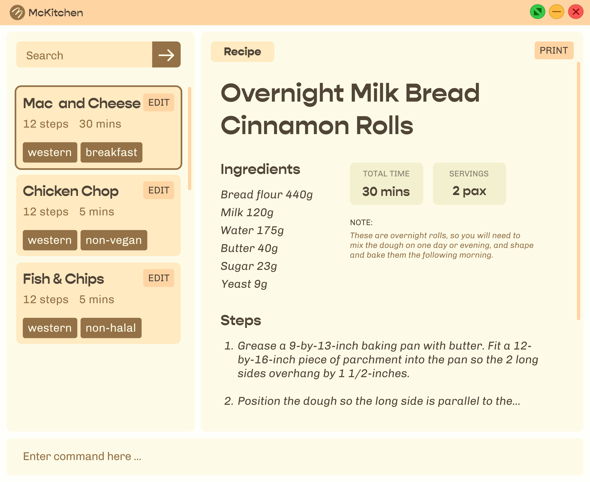

McKitchen (My-CLI-Kitchen) is a desktop application that can quickly store, edit, and search for recipes by running a single command, ideal for the fast typists, amateur cooks, or busy students or executives who want a simple way to store or search for simple recipes to cook.

## About this Guide
This guide is intended to be used by those who are interested in how to use McKitchen -- whether you're a user of McKitchen or simply doing research, welcome! A [table of content](#table-of-content) is located just below this section to improve navigation of this guide and bring you to the portion of the guide that you are interested in. Additionally, in each of those sections, we've linked a small text titled "return to Table of Content" for you to be able to quickly jump back to the top should you choose to. 

Throughout the document you may encounter some of these symbols, and they denote the following:
* :information_source: : General tips regarding the section or feature that you are currently on
* :computer: : Tips for advanced users
* :heavy_exclamation_mark: : Warning! Pay close attention to them to understand the potential drawbacks of related to the section or feature that you are currently on.

## Table of Content
- [Quick start](#quick-start)
- [Features](#features)
    * [Adding a new recipe: `add`](#adding-a-new-recipe---add-)
    * [Edit an existing recipe: `edit`](#edit-an-existing-recipe---edit-)
    * [Delete an existing recipe: `delete`](#delete-an-existing-recipe---delete-)
    * [List all stored recipes: `list`](#list-all-stored-recipes---list-)
    * [View recipe an existing recipe: `view`](#view-recipe-an-existing-recipe---view-)
    * [Clear (delete all) existing recipes: `clear`](#clear--delete-all--existing-recipes---clear-)
        + [Forced Clear:](#forced-clear-)
    * [Store recipe](#store-recipe)
    * [Load recipe](#load-recipe)
- [FAQ](#faq)
- [Command Summary](#command-summary)

---

## Quick start

In this section, we will get you started on the things you need to do prior to using McKitchen -- namely, installing Java 11.

1. Ensure you have Java `11` or above installed in your Computer by clicking [here](https://www.java.com/en/download/help/version_manual.html).
   1. If you do not have Java version >= `11` installed, refer to [this installation guide](https://docs.oracle.com/en/java/javase/11/install/overview-jdk-installation.html).

2. Download the latest `McKitchen.jar` from [our GitHub page](https://github.com/AY2122S2-CS2103T-T17-2/tp/releases).

3. Copy the file to the folder you want to use as the _home folder_ for your McKitchen.

4. To run the application, if you're on:
   1. Windows: Double-click the file to start the app.
   2. MacOS/UNIX: Open the terminal in the _home folder_ (Step 3) and issue the following command: `java -jar McKitchen.jar`

:information_source: **Alternatively**, you can allow the application Full Disk Access and be able to run the McKitchen by double-clicking on it by following [this post](https://discussions.apple.com/thread/252709578).

The GUI similar to the below should appear in a few seconds <to update>.  
Note how the app contains some sample data. 
      

5. Type the command where prompted "Enter command here" and press Enter to execute it.   Example: typing **`help`** and pressing Enter will open the help window.

6. Refer to the [Features](#features) below for details of each command.

---

## Features

In this section we would be going over what each feature does, how to go about doing so, and what it achieves.  

:information_source: For a summarised version, feel free to jump to the [Command Summary](#command-summary).

### Add a new recipe: `add`
Add a recipe by specifying its name, ingredients, and steps to prepare the dish. 
Usage: `add -n <name of recipe> -d <completion time of recipe> -ss <serving size of recipe> -i <ingredients of recipes separated by commas> -s <steps separated by commas> -t <tags associated with recipe> (optional)`  
Example:
- `add -n Aglio Olio -d 5 -ss 1 -i spaghetti 56 grams, garlic 3 cloves, bacon 3 slices, olive oil 110 ml -s Cook the spaghetti until al dante, Saute the chopped garlic, Toss spaghetti in the sauce, taste and season with salt and black pepper`
  - This creates a recipe for "Aglio Olio" with a completion time of 5 mins, serving size of 1 person/pax and ingredients consisting of 56 grams of spaghetti, 3 cloves of garlic, 3 slices of bacon, 110 ml of olive oil and a non-fixed amount of salt, and pepper (to taste) with the steps of:
    1. Cook the spaghetti until al dante,
    2. Saute the chopped garlic,
    3. Toss the spaghetti in the sauce,
    4. Taste and season with salt and black pepper.

 [return to table of content](#table-of-content)

### Edit an existing recipe: `edit`
Edits a recipe by specifying its name, ingredients, and steps to prepare the dish. 

:information_source: **Only specify the parts of the recipe that you want to edit!** The only necessary information needed is the name or number of the recipe that you would like to edit 

Usage: `edit <name of recipe to be edited> [-n <new name of recipe>] [-d <new completion time of recipe>] [-ss <new serving size of recipe>] [-i <new ingredients of recipes separated by commas>] [-s <new steps separated by commas>] [-t <new tags associated with recipe>]`  
   OR  
`edit -x <index of recipe to be edited> -n <new name of recipe> -d <new completion time of recipe> -ss <new serving size of recipe> -i <new ingredients of recipes separated by commas> -s <new steps separated by commas> [-t <new tags associated with recipe>]`
Example:
- `edit Aglio Olio -n Spicy Aglio Olio -i spaghetti 56 grams, garlic 3 cloves, bacon 3 slices, olive oil 110 ml, Chilli flakes 10 teaspoons -s Cook the spaghetti until al dante, Saute the chopped garlic, Toss spaghetti in the sauce, taste and season with salt, black pepper and chilli flakes`
    - This edits the recipe named "Aglio Olio" and updates its attributes with a name of "Spicy Aglio Olio" and ingredients consisting of 56 grams of spaghetti, 3 cloves of garlic, 3 slices of bacon, 110 ml of olive oil and 10 teaspoons of chilli flakes with the steps of:
        1. Cook the spaghetti until al dante,
        2. Saute the chopped garlic,
        3. Toss the spaghetti in the sauce,
        4. Taste and season with salt, black pepper and chilli flakes.

- `edit -x 1 -n Spicy Aglio Olio [and other information that you would like to edit]`

[return to table of content](#table-of-content)

### Delete an existing recipe: `delete`
Removes a stored recipe based on the number it is associated with in the `list`  
Usage: `delete <recipe name>` or `delete -x <recipe number>`   
Example:
- `delete Aglio Olio`
    - This would delete the recipe called 'Aglio Olio'.
- `delete -x 1`
      - This would delete the first entry in the list of recipes.

:information_source: **Deletion of recipes by its name are case-insensitive!** 
To make it a little more convenient for you, McKitchen is able to delete a recipe by its name by making it case-insensitive. This means that `delete aglio olio` works too!

[return to table of content](#table-of-content)

### Find an existing recipe: `find`
Searches for a recipe based on the keywords (seperated by comma).  
Usage: `find <keyword> [other keywords, seperated by commas]`  

Example: 
- Let's say that you would like to cook a Western cuisine and have spaghetti and garlic on hand.  
        The command that you would execute should look something like this:
    - `find western, spaghetti, garlic`

:information_source: **Keywords used for the find feature are case-insensitive!** 
Don't worry, McKitchen would still be able to find "Secret Family Sauce" even if you search for "secret family sauce" (or searching for the secret ingredient) :wink:

[return to table of content](#table-of-content)

### List all stored recipes: `list`
Displays all the available recipes that has been stored locally  
Usage: `list`

[return to table of content](#table-of-content)

### View an existing recipe: `view`
View the contents of an existing stored recipe based on recipe name or number.  
Usage: `view <recipe name>` or `view -x <recipe number from list>`  
Example:
- `view Aglio Olio`
    - This would display the full contents of the recipe matching the name "Aglio Olio" including its ingredients and steps to prepare the dish.

- `view -x 1`
    - This would display the full contents of the first recipe in the list which includes its ingredients and steps to prepare the dish.

️:information_source: Recipe names are case-insensitive to make it a little more convenient for you. This means that `view aglio olio` works too!

[return to table of content](#table-of-content)

### Clear (delete all) existing recipes: `clear`
Clears the entire recipe book. A confirmation prompt would show up before this operation is executed.  

Usage: `clear`

The program would then prompt you to confirm. Type in `yes` to clear and `no` to cancel the clear request.

Example: 
- clear
    - This would generate a clear request that requires a confirmation. To confirm to clear the recipe book, type in 'yes',
    - else, type in 'no'.

️:heavy_exclamation_mark: :computer: To clear the recipe book without the confirmation, you can include the prefix `-f` after the `clear` (forced clear) command. McKitchen is only able to restore the default sample recipes by running `reset`. Currently, McKitchen isn't able to undo actions in the application so use this feature with caution! 

#### Forced Clear:
Usage: `clear -f`  
Example:
- clear -f
    - This would clear the recipe book without having the need for any confirmation.

[return to table of content](#table-of-content)

### Save recipes
Save the recipes in a human-readable text file on your computer and is modifiable through a text editor as it is JSON-formatted.  
Usage: (Automatically updates text file upon each modifying (writing) operation).

️:information_source: Recipes would be saved in a folder called "data" from where McKitchen is located.  
Example: If McKitchen is saved in the "Downloads" folder, recipes would be saved in a folder called "data" in "Downloads" as "recipebook.json".

️:computer: If you are familiar with how file paths works in your operating system, the "recipebook.json" file would be created in a folder **relative** to McKitchen.jar (data/recipebook.json) 

[return to table of content](#table-of-content)

### Load recipe
Load existing recipes from the text file on your computer. Modifications to this file would be displayed accordingly as long as the format is followed.  
Usage: (Automatically loads the recipes upon launching the application).

️:information_source: Recipes would be loaded from a file called "recipebook.json" in a folder called "data" from where McKitchen is located.  
Example: If McKitchen is stored in the "Downloads" folder, recipes would be loaded in a folder called "data" which should "recipebook.json".   
If the file or folder does not exist, McKitchen would automatically create them and provide a sample recipes to allow you to explore the application without needing to input their own recipes.  

:computer: McKitchen would try to locate and load "recipebook.json" relative to where it's being ran (./data/recipebook.json).  
️:computer: If you are familiar with JSON, you can modify the file to add new recipes or modify aspects of an existing recipe without needing to run McKitchen. You are advised to strictly follow the formatting of the application as failure to do so may result to certain aspects of the recipes to not load properly, if at all.

###### [return to table of content](#table-of-content)

---

## FAQ
**Q: If I am unsure of the exact amount of ingredients im adding into my recipe, can I save it first and come back to it later?**  
You cannot save the recipe with empty fields. Instead, you can add a dummy value into the field you are unsure of, then edit it after you are sure of the input values.

**Q: Is there a faster way to delete a recipe instead of copying the recipe name word for word?** 
The fastest way is to delete a recipe by its number in the list `delete -x <recipe number>`

**Q: How do I transfer my recipes to another computer?** 
Copy the recipebook.json file into your new computer.

**Q: What do I need to consider when adding a new recipe?** 
You need to consider the:
1. Recipe name (`-n`),
2. Completion time (`-d`),
3. Serving Size (`-ss`),
4. Ingredients (`-i`),
5. Steps (`-s`)

   The tags are optional.

**Q: If I deleted one of the provided (default) recipe by accident, can I retrieve it back?** 
You can use the reset command to retrieve the recipe. For newly added recipes, you will not be able to undo your deletion. 

**Q: If I typed in 'clear' or 'reset' in the command bar, will it take effect immediately?** 
It will not take effect immediately. A confirmation prompt will allow you to confirm your decision. Alternatively, you can specify the prefix -f to clear or reset without any confirmation prompt. 

###### [return to table of content](#table-of-content)

---

## Command Summary

### How to read this table?
1. Actions (what you would want to do) is on the left while the command associated to it is on the right.
2. Almost all the details of the commands are needed to be given before the command can be executed properly.
   1. **Compulsory** details are denoted by angled-brackets such as \<mandatory details>.
   2. **Optional** details of the command that are enclosed in square brackets such as [optional details].
3. What does it mean when the input command says "... separated by commas"?

| Action               | Command format                                                                                                                                                                                                 |
|----------------------|----------------------------------------------------------------------------------------------------------------------------------------------------------------------------------------------------------------|
| add a new recipe     | `add -n <name of recipe> -d <prep time of recipe> -ss <serving size/portions of recipe> -i <ingredients separated by commas> -s <steps separated by commas> [-t <tags separated by commas>]`                   |
| edit a recipe        | `edit <name of recipe> -n <name of recipe> -d <prep time of recipe> -ss <serving size/portions of recipe> -i <ingredients separated by commas> -s <steps separated by commas> [-t <tags separated by commas>]` |
| delete a recipe      | `delete <recipe name>`   or   `delete -x <recipe number from list>`                                                                                                                                      |
| find a recipe        | `find <keyword> [other keywords separated by commas]`                                                                                                                                                          |
| list a recipe        | `list`                                                                                                                                                                                                         |
| view specific recipe | `view <recipe number from list>`   or   `view <recipe name>`                                                                                                                                           |

###### [return to table of content](#table-of-content)

