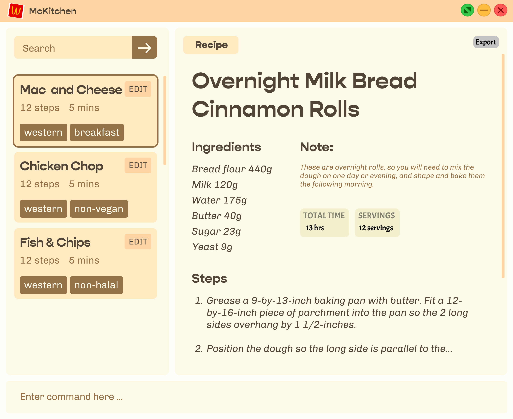

**McKitchen (My-CLI-Kitchen) is a desktop application that can quickly store, edit, and search for recipes by running a single command, ideal for the fast typists, home cooks, and students who want a simple way to store or search for simple recipes to cook.** While it has a GUI, most of the user interactions happen using a CLI (Command Line Interface).

* If you are interested in using McKitchen, head over to the [**User Guide**](UserGuide.html).
* If you are interested about developing McKitchen, the [**Developer Guide**](DeveloperGuide.html) is a good place to start.

**Acknowledgements**
* This project was modified from `AddressBook Level-3` from [se-education.org](https://se-education.org/).
* Libraries used: [JavaFX](https://openjfx.io/), [Jackson](https://github.com/FasterXML/jackson), [JUnit5](https://github.com/junit-team/junit5)
